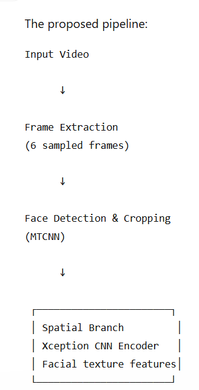
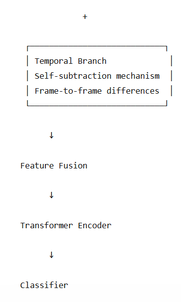
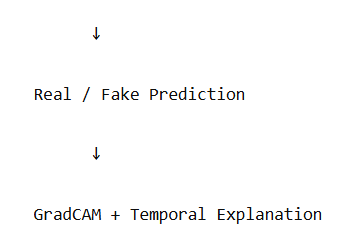
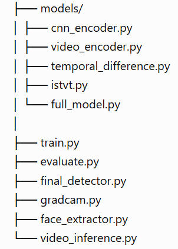

# Interpretable Spatial-Temporal Transformer for Deepfake Detection

## Overview

Deepfake generation techniques have become increasingly realistic, making automated detection a challenging problem. This project implements an interpretable spatial-temporal deepfake detection framework inspired by the ISTVT (Interpretable Spatial-Temporal Video Transformer) approach.

The model learns:

- **Spatial facial artifacts** from individual frames
- **Temporal inconsistencies** across consecutive frames

Along with classification, the system provides visual explanations using GradCAM and temporal frame importance analysis.

---

# Motivation

Deepfake detectors often achieve high accuracy but lack interpretability. This project aims to build a detector that not only predicts whether a video is manipulated but also explains the regions and frames influencing the decision.

---

# Architecture

The complete pipeline:








---

# Methodology

## Spatial Feature Extraction

A lightweight Xception-based CNN backbone extracts facial representations from video frames.

It captures manipulation artifacts such as:

- texture inconsistencies
- blending artifacts
- abnormal facial patterns

---

## Temporal Feature Learning

Adjacent frame differences are calculated:

-F2 - F1
-F3 - F2
-...
-Fn - Fn-1


This highlights temporal inconsistencies introduced during deepfake generation.

---

## Transformer Fusion

Spatial and temporal features are fused and passed through a Transformer encoder to learn relationships across video frames.

---

# Explainability

## Spatial Explanation

GradCAM heatmaps highlight regions contributing to the model prediction.


## Temporal Explanation

Frame-level importance scores identify suspicious frames contributing to the final classification.

---

# Results

Evaluation on a subset of FaceForensics++:

| Metric | Score |
|---|---|
| Accuracy | ~95% |
| Precision | 1.00 |
| Recall | ~0.91 |
| F1 Score | ~0.95 |
| AUC | ~0.96 |

The model provides prediction confidence along with visual explainability.

---

# Project Structure





---

# Installation

Clone repository:

```bash
git clone <repository-link>

cd ISTVT-Deepfake-Detector

pip install -r requirements.txt

---

# Usage

python train.py

python evaluate.py

python video_inference.py

Example output:

Prediction: FAKE

Confidence: 96%
